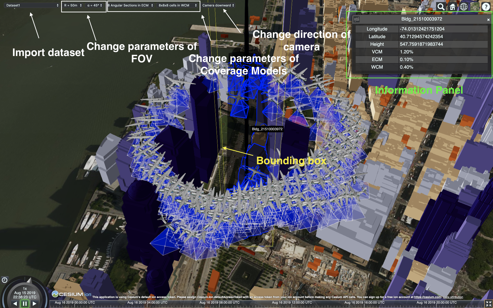

# A Web-based Tool for 3D Spatial Coverage Measurement

This repository contains source code for the paper *A Web-based Visualization Tool for 3D Spatial Coverage Measurement of Aerial Images*

The link of the paper: **to do**

The link of the demo video: **to do**

## Prerequisite 
Since this is a web-based tool, you can directly visit the GitHub Pages: https://mazeyu.github.io/3D_Spatial_Coverage_Model_Demo/

Our website depends on CesiumJS library. Currently, it works on released version 1.62. But problems can arise if Cesium has some updates. Actually, recently Cesium change the return 
value of its API *getProperty("longitude")* and *getProperty("latitude")* from radians to degrees.
I have to fix the code slightly as a result. So please contact us if you find the website doesn't work.

## Datesets
 Currently we provide a small dataset in file *data1.js*.
 The format is like this:
 ~~~
 data1={"lat":{"0":...}, "lng": ..., "hgt": ..., "yaw": ..., "pitch": ..., "roll": ..., "t": ...}
 ~~~
 If you want to generate your own dataset, please make sure you follow this format.

## Interaction

The GUI of the tool is like above. 
You can switch to different datasets through the first menu bar. For interactive querying, the tool enables selecting one of the visible buildings as a geographical region (QR) to measure its spatial coverage in the 3D space. Once defining QR, the coverage is measured using the three coverage measurement models (VCM, ECM, and WCM) and the results are displayed in an information panel that is positioned in the upper-right corner of the window. You can change the parameters of the FOVs and models through the menu bars on the top.

Note that due to the randomness of our algorithm, the results may vary for the same case. But we choose the number of iterations high enough to guarantee that the error is about 1% in average. If necessary, we can increase this number to increase the accuracy.

Please refer to the paper for more detail. 

 ## Citation
 If you used this code for your experiments or found it helpful, consider citing the following paper:
 ~~~
 ~~~